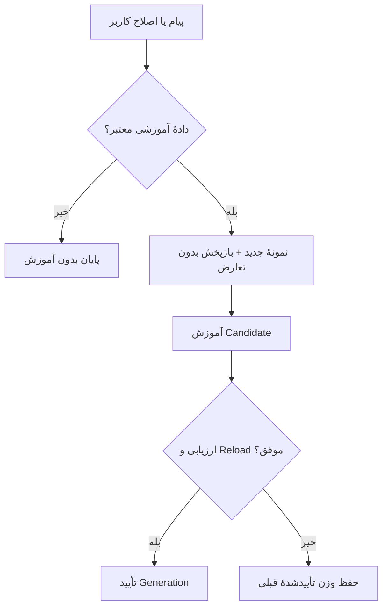

# Personal Brain — نسخهٔ 0.34.0-smart-brain

Brain همچنان آموزش واقعی LoRA روی همان مدل انتخاب‌شده است. این نسخه، انتخاب دادهٔ آموزشی، بازپخش، حلقهٔ آموزش و تأیید آداپتر را بازنویسی می‌کند. مدل پایهٔ دیگری برای هر ایجنت بارگذاری نمی‌شود. آرشیو آموزش وارد Context چت نمی‌شود؛ گزینهٔ Zero-context همچنان مستقل و در اختیار کاربر است.

## استفاده

1. مدل را در Models انتخاب کنید و در Brain موتور آموزش همان مدل را آماده کنید.
2. برای اصلاح مستقیم، قسمت **Teach a correction** را باز کنید: سؤال یا موقعیت را بنویسید و جواب درست خودتان را وارد کنید.
3. **Learn this correction** را بزنید. پیشرفت و امکان Stop در همان صفحه نمایش داده می‌شود.
4. شمارهٔ Generation فقط پس از ارزیابی Candidate و بارگذاری موفق آداپتر افزایش می‌یابد.

در چت عادی، سلام و سؤال روشن باعث شروع آموزش نمی‌شوند. جملهٔ روشن «اسم من رضاست» بدون فراخوانی Teacher اضافی به نمونه تبدیل می‌شود. برای جمله‌های دیگر، Teacher فقط از همان پیام کاربر شاهد می‌آورد. سؤال همراه با یک گزارهٔ آموزشی ممکن است محافظه‌کارانه کنار گذاشته شود؛ فرم سؤال/جواب مسیر دقیق برای چنین مواردی است.

## معماری

| ماژول | مسئولیت |
|---|---|
| `learning_data.py` | قرارداد نمونه، نرمال‌سازی، استخراج قطعی، شاهد متنی، حذف تکرار/تعارض و ترتیب بازپخش |
| `training_loop.py` | انتخاب Micro-step، انتقال یک نمونه به Device، بررسی Gradient و ارزیابی قبل/بعد |
| `trainer_worker.py` | بارگذاری یک Checkpoint، LoRA/PEFT، Tokenization و ذخیرهٔ Candidate |
| `personal_brain.py` | Profile، آرشیو، اجرای Worker، Timeout/Cancel، تراکنش و بازیابی |
| `server.py` | هماهنگی با مدل مشترک، Preview، آموزش، توقف/راه‌اندازی inference و تأیید |
| `app.js` / `stream_protocol.js` | فرم اصلاح، حفظ Draft، وضعیت Job و آزادشدن Composer در پایان |

## قرارداد داده

هر نمونه دارای `user`، `assistant`، `kind`، `evidence` و `source` است. `split` هنگام ساخت Curriculum به `new` یا `replay` تبدیل می‌شود. حداکثر ۱۲ نمونهٔ معتبر برای یک درس پذیرفته می‌شود. سؤال تا ۶۰۰۰ و جواب تا ۱۲۰۰۰ نویسه محدود است.

- جواب خود مدل در چت به‌عنوان Target استفاده نمی‌شود.
- در حالت خودکار، `evidence` باید در پیام کاربر باشد و جواب نیز از همان شاهد استخراج شود. جواب بازنویسی‌شده‌ای که این شرط را نداشته باشد کنار گذاشته می‌شود.
- در فرم اصلاح مستقیم، سؤال و جواب را خود کاربر می‌نویسد؛ نیاز به تولید Teacher نیست.
- درخواست ابزار، قرار تقویم و برنامهٔ موقت در دستور Teacher، دانش دائمی مدل محسوب نمی‌شوند.
- این کنترل، منشأ متن را بررسی می‌کند؛ تضمین عمومی صحت معنایی تمام خروجی‌های Teacher نیست.

## بازپخش و اصلاح

برای یک سؤال، جواب جدید جای جواب قدیمی را در Batch می‌گیرد. برای نام کاربر و نام دستیار، کل گروه عبارت‌های هم‌معنی کنار گذاشته می‌شود؛ بنابراین اصلاح انگلیسی می‌تواند جواب قدیمی فارسیِ همان Identity را کنار بزند.

فقط Packetهای تأییدشده وارد بازپخش می‌شوند. `replay_samples=0` واقعاً بازپخش را خاموش می‌کند. انتخاب از حداکثر ۲۵۶ Packet تأییدشدهٔ اخیر انجام می‌شود و Cache با تغییر فایل آرشیو یا Ledger نامعتبر می‌شود. سابقهٔ قدیمی پاک نمی‌شود؛ تشخیص تکرار نیز به همین پنجرهٔ اخیر محدود است.

در بودجهٔ سه‌مرحله‌ای، ترتیب نمونه‌ها جدید/بازپخش/جدید است. اگر بودجه فقط یک Step باشد، اولویت با نمونهٔ جدید است. ترتیب داخل هر گروه با Seed وابسته به Generation تغییر می‌کند تا هر بار تنها اولین عبارت آموزش نبیند.

اصلاح Curriculum پاسخ قدیمی را از آموزش جدید حذف می‌کند؛ پاک‌کردن تضمینی اثر یک واقعیت از وزن‌های قبلی نیست.

## ارزیابی و فعال‌سازی

قبل و بعد از آموزش، Loss حداکثر چهار نمونهٔ جدید و چهار نمونهٔ بازپخش با `eval` و `no_grad` سنجیده می‌شود. Gradient غیرمتناهی پیش از Optimizer رد می‌شود. افزایش Loss بیش از `max(0.02, 2%)` برای دادهٔ جدید یا `max(0.05, 10%)` برای بازپخش، Candidate را رد می‌کند.

این معیار یک **کنترل سلامت محدود روی Curriculum** است؛ آزمون مستقل Recall یا تضمین حفظ تمام دانش مدل نیست. این بررسی‌ها حداکثر ۱۶ Forward اضافی دارند. سربار زمانی آن روی مدل واقعی باید اندازه‌گیری شود؛ کاهش tok/s یا افزایش سرعت آموزش ادعا نشده است.

پس از بررسی، Candidate به GGUF تبدیل می‌شود و مدل با آن راه می‌افتد. فراخوانی `activate_model` در همین Reload دیگر Candidate زنده را rollback نمی‌کند. فرآیند تازه پس از کرش، Candidate تأییدنشده را برمی‌گرداند. نقطهٔ تأیید روی دیسک ثبت می‌شود؛ کرش حین پاک‌سازی، تأیید را در شروع بعدی تکمیل می‌کند.

Generation و وضعیت ارزیابی در Meta تنها پس از تأیید ثبت می‌شوند. خاموش‌کردن Brain یا Cancel پیش از تأیید، مسیر rollback را فعال می‌کند.

## حافظه، لغو و سازگاری

- inference پیش از آموزش متوقف می‌شود؛ نسخهٔ جداگانه‌ای از Checkpoint برای هر Agent ساخته نمی‌شود.
- روی CPU، اندازهٔ واقعی Checkpoint و Backend مبنای برآورد RAM هستند. نام مدل یا وجود یک iGPU به‌تنهایی معیار نیست.
- این برآورد محافظه‌کارانه است؛ جایگزین Peak RAM اندازه‌گیری‌شده و تضمین OOM نشدن نیست.
- نمونه‌های Tokenized روی CPU می‌مانند و فقط نمونهٔ جاری به Device منتقل می‌شود.
- Timeout حتی برای Worker بی‌خروجی اعمال می‌شود. `trainer_timeout` پیش‌فرض ۳۶۰۰ ثانیه دارد و از تنظیمات API بین ۳۰ تا ۱۴۴۰۰ قابل تغییر است.
- تبدیل GGUF هم Cancel/Timeout دارد. فایل موقت Batch پس از اجرای Worker حذف می‌شود؛ آرشیو طبق گزینهٔ موجود `keep_training_archive` باقی می‌ماند.
- پایان موفق، خطا و Cancel همگی Composer را آزاد می‌کنند؛ حالت غیر Strict نیز آن را برای همیشه قفل نمی‌کند.
- Profileها، تنظیمات، آرشیو قدیمی، LoRA موجود، مسیر Bake و Zero-context حفظ می‌شوند. Dependency اجباری جدیدی افزوده نشده است.

## شواهد و محدودیت‌ها

تست‌های جدید در `tests/test_brain_rewrite.py` و تست اجرایی Node قرار دارند. `scripts/benchmark_brain.py` روی مبنای 0.33 و نسخهٔ جدید اجرا شده و JSON خام در `audit/brain-benchmark-*.json` است.

در هفت نمونهٔ منفی بازتولیدشده، استخراج اشتباه Identity از ۷ مورد به صفر رسید؛ چهار پاسخ قدیمی متعارض از Batch اصلاح حذف شد؛ بازپخش با مقدار صفر از یک نمونه به صفر رسید. این اعداد دقت عمومی زبان یا مدل GGUF نیستند.

آزمون کوچک واقعی PyTorch با چهار پارامتر، سه Step و وزن پایهٔ Frozen اجرا شد: Loss از 0.693147 به 0.267507 رسید و وزن پایه تغییر نکرد. این آزمون، اجرای حلقه و کنترل‌هایش را می‌سنجد؛ جایگزین آموزش/Recall یک مدل میلیاردپارامتری نیست.

ریسک‌های باز: برخورد هویت Profile برای دو فایل هم‌نام/هم‌معماری در قرارداد قدیمی، تغییر هم‌زمان مدل و آموزش در همهٔ مسیرهای Remote، نسخه‌بندی Converter و وابستگی‌ها، و کیفیت بلندمدت پس از تعداد زیاد اصلاح هنوز نیاز به ارزیابی تکمیلی دارند. مدل واقعی و سخت‌افزار Windows هدف در این محیط موجود نبودند.

## پیشنهاد توسعه

1. یک مجموعهٔ ثابت فارسی/انگلیسی از اصلاح‌ها و Recallهای جداگانه بسازید؛ کیفیت را روی مدل منتخب و قبل/بعد هر نسل اندازه بگیرید.
2. آموزش چند اصلاح را برای زمان بیکاری دسته‌بندی کنید تا بارگذاری Checkpoint و Restartهای مکرر کمتر شوند؛ همچنان یک Worker آموزش داشته باشید.
3. مهاجرت نسخه‌دارِ شناسهٔ Profile را با حفظ LoRAهای موجود طراحی کنید. سپس آزمون Crash/Model switch را روی Windows انجام دهید.
4. در صورت نیاز، حافظهٔ ساخت‌یافتهٔ قابل ویرایش را به‌صورت قابلیت مستقل و انتخابی طراحی کنید؛ آن را پنهانی وارد مسیر Zero-context نکنید.

منابع فنی: [PEFT troubleshooting](https://github.com/huggingface/peft/blob/main/docs/source/developer_guides/troubleshooting.md)، [PyTorch gradient norm](https://docs.pytorch.org/docs/stable/generated/torch.nn.utils.clip_grad_norm_.html).

## اصلاحات پایداری 0.34.1

خطای نصب Trainer اکنون به وضعیت نهایی error/cancelled می‌رسد؛ خطای ثانویه در handler رخ نمی‌دهد. روشن‌کردن مجدد Brain، درخواست لغوِ کار قبلی را پس نمی‌گیرد. پیش‌نمایش درس از پرچم لغوِ کار قدیمی مستقل است؛ در صورت تغییر مدل هنگام compilation رد می‌شود. شکست preflight مدلی را که پیش از کار خاموش بوده، خودبه‌خود بارگذاری نمی‌کند. دانلود و آماده‌سازی پس‌زمینه، کادر چتِ مدل آماده را قفل نمی‌کنند.
